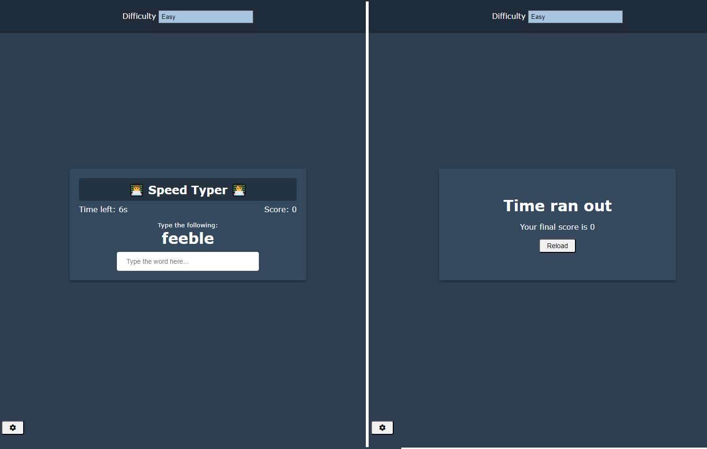
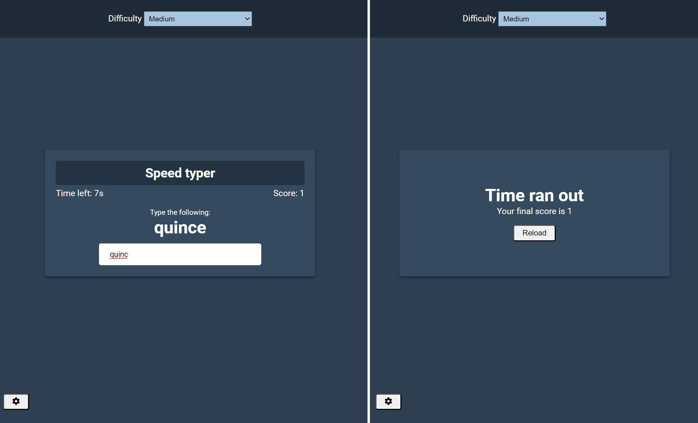

# Udemy--vanillawebprojects-12

**The twelfth out** of a series of **20 small projects** in **Vanilla JavaScript** from the [**Udemy course**](https://www.udemy.com/course/web-projects-with-vanilla-javascript/) by author [Brad Traversy](https://www.traversymedia.com/) with this [Brad's original GitHub repository](https://github.com/bradtraversy/vanillawebprojects).

# 12: Speed Typer Typing Game

Game to beat the clock by typing random words

## Project Specifications

- Create game UI including a difficuly setting
- Generate random word and place in DOM
- Score increase after word is typed
- Implement timer
- Add certain amount of time after word is typed based on difficulty
- Store difficulty setting in local storage

## Original preview

    

<!-- ## My solution preview

    

## My solution features -->

# Author

Website - [Petr Bednarski](https://github.com/pettik)  
Frontend Mentor - [@pettik](https://www.frontendmentor.io/profile/pettik)
